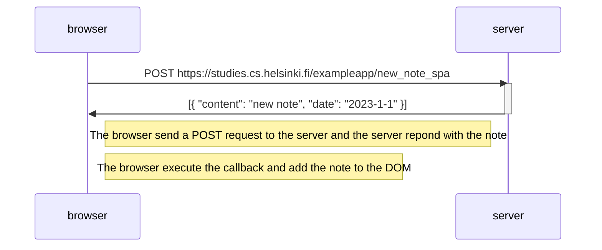

# SPA new note diagram

```mermaid
sequenceDiagram
    browser->>server: POST https://studies.cs.helsinki.fi/exampleapp/new_note_spa
    activate server
    server->>browser: [{ "content": "new note", "date": "2023-1-1" }]
    deactivate server
    Note right of browser: The browser send a POST request to the server and the server repond with the note
    Note right of browser: The browser execute the callback and add the note to the DOM

```
